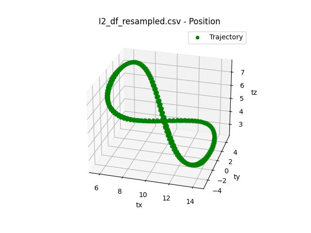
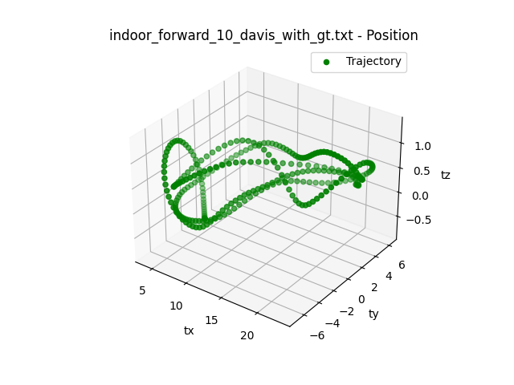

# Drone Trajectory Processing and Visualization

This repository contains a collection of Python scripts for processing and visualizing drone trajectories. The scripts perform various operations such as segmenting trajectories into input and output segments, resampling trajectories, and plotting them. This is useful for traingin models for trajector prediction in 3D.



## Scripts

### 1. `process_single_trajectory.py`

This script processes a single drone trajectory to create input and output segments. The segments are saved in `.npz` format.

#### Usage

```bash
python process_single_trajectory.py <trajectory_file> <input_segment_length> <output_segment_length> [--compute_velocity]
```

#### Arguments

- `trajectory_file`: Path to the CSV or TXT file containing the drone position trajectory.
- `input_segment_length`: Length of each input segment.
- `output_segment_length`: Length of each output segment.
- `--compute_velocity`: Optional flag to compute velocity segments instead of position.

#### `.npz` File Contents

- `input_segments`: A 2D NumPy array where each column represents an input segment. Rows correspond to `tx`, `ty`, `tz` in that order.
- `output_segments`: A 2D NumPy array where each column represents an output segment. Rows correspond to `tx`, `ty`, `tz` in that order.
- `num_input_segments`: A scalar indicating the number of input segments.
- `num_output_segments`: A scalar indicating the number of output segments.
- `input_segment_length`: A scalar indicating the length of each input segment.
- `output_segment_length`: A scalar indicating the length of each output segment.

### 2. `process_multiple_trajectories.py`

This script processes multiple drone trajectories in a directory to create input and output segments for each trajectory. The segments are concatenated and saved in a single `.npz` file.

#### Usage

```bash
python process_multiple_trajectories.py <directory_path> <input_segment_length> <output_segment_length> [--compute_velocity]
```

#### Arguments

- `directory_path`: Path to the directory containing multiple drone trajectory files.
- `input_segment_length`: Length of each input segment.
- `output_segment_length`: Length of each output segment.
- `--compute_velocity`: Optional flag to compute velocity segments instead of position.

#### `.npz` File Contents

The `.npz` file contains multiple arrays, each corresponding to a different trajectory file. The naming convention is `<filename>_input_segments` and `<filename>_output_segments`.

- `num_input_segments`: A dictionary mapping filenames to the number of input segments for each file.
- `num_output_segments`: A dictionary mapping filenames to the number of output segments for each file.
- `input_segment_length`: A scalar indicating the length of each input segment.
- `output_segment_length`: A scalar indicating the length of each output segment.

### 3. `trajectory_to_segmetns.py`

This script takes a directory of drone trajectories and divides each trajectory into equal segments of a given length.

#### Usage

```bash
python divide_into_segments_multiple.py <directory_path> <segment_length> [--compute_velocity]
```

#### Arguments

- `directory_path`: Path to the directory containing multiple drone trajectory files.
- `segment_length`: Length of each segment.
- `--compute_velocity`: Optional flag to compute velocity segments instead of position.

#### `.npz` File Contents

The `.npz` file contains multiple arrays, each corresponding to a different trajectory file. The naming convention is `<filename>_segments`.

- `segment_length`: A scalar indicating the length of each segment.

### 4. `resample_trajectory.py`

This script resamples each drone trajectory in a directory at a given sampling time. The resampled trajectories are saved in a new directory.

#### Usage

```bash
python resample_trajectory.py <directory_path> <sampling_time_in_seconds>
```

#### Arguments

- `directory_path`: Path to the directory containing multiple drone trajectory files.
- `sampling_time_in_seconds`: The time interval for resampling in seconds.

### 5. `plot_trajectory.py`

This script plots a single drone trajectory from a CSV or TXT file. It also has an option to plot velocity vectors.

#### Usage

```bash
python plot_trajectory.py <trajectory_file> [--plot_velocity]
```

#### Arguments

- `trajectory_file`: Path to the CSV or TXT file containing the drone position trajectory.
- `--plot_velocity`: Optional flag to plot velocity vectors.

## File Formats

The expected file format for the trajectory files is CSV or TXT with the following columns:

- `timestamp`: The time at which the sample was taken.
- `tx`: The x-coordinate of the drone at the given timestamp.
- `ty`: The y-coordinate of the drone at the given timestamp.
- `tz`: The z-coordinate of the drone at the given timestamp.

## Ignored Files and Directories

The `.gitignore` file is set to ignore any `.npz` files and directories that start with "resampled".
